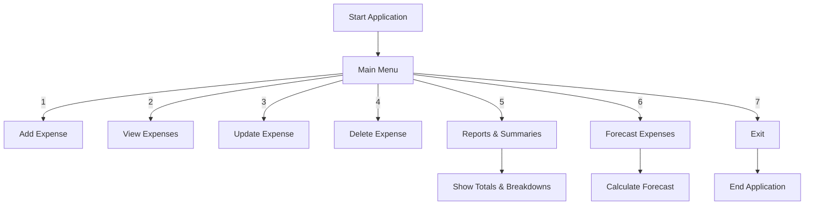

# 💰 Expense Tracker – Python + SQLite3


---

A **command-line based Expense Tracker** built using **Python** and **SQLite3**, designed to help users efficiently manage, analyze, and forecast daily spending.  
This project demonstrates **clean code**, **modular structure**, and **database-driven operations**, ideal for both **personal finance management** and **portfolio demonstration**.

---

## Table of Contents
- [Project Overview](#project-overview)
- [Goals](#goals)
- [Features](#features)
- [Application Flow](#application-flow)
- [Technologies Used](#technologies-used)
- [Project Structure](#project-structure)
- [Setup Instructions](#setup-instructions)
- [How It Works](#how-it-works)
- [Visualizations](#visualizations)
- [Example Results](#example-results)
- [Error Handling](#error-handling)
- [Future Scope](#future-scope)
- [Contributing](#contributing)
- [License](#license)
- [Contact](#contact)


## Project Overview

The **Expense Tracker** is a **lightweight command-line application** that allows users to:
- Record daily expenses with category and note  
- View, update, and delete transactions  
- Analyze spending patterns  
- Forecast upcoming expenses based on recent trends  
- Backup and restore data safely

No external dependencies, simple to set up, and ideal for tracking personal finances offline.

---

## Goals

- Build a **modular, database-backed Python app**
- Demonstrate **CRUD operations** using SQLite
- Implement **basic analytics** and **forecasting**
- Provide **maintenance scripts** for database handling
- Ensure **clarity, portability, and simplicity**

---

## Features

### 🧾 Core Functionalities
- Add, View, Update, and Delete expenses  
- Input validation for all operations  
- Date and category-based querying  

### 📊 Reports & Analytics
- Total, Monthly, and Category-wise spending reports  
- Highest and Lowest expense summaries  
- Automatic expense forecasting  

### 🧰 Utilities
- Backup, Restore, and Migrate database  
- Reset IDs and Seed sample data  
- CLI-based menu navigation  

---

## Application Flow

Here’s the high-level workflow of the application:

### Flowchart

> **Note:** If the diagrams do not render, visit [Mermaid Live Editor](https://mermaid-js.github.io/mermaid-live-editor/) to view or modify them.



---

## Technologies Used

```
| Technology        | Purpose                        |
| ----------------- | ------------------------------ |
| **Python 3.x**    | Core programming language      |
| **SQLite3**       | Lightweight local database     |
| **CLI Interface** | For terminal-based interaction |

```

---

## Project Structure

```graphql
Expense-Tracker/
│
├── main.py            # Main application logic & menu
├── init_db.py         # Initialize database
├── backup_script.py   # Backup data to expenses_backup table
├── migrate.py         # Database schema migration
├── reset_id.py        # Reset ID sequence
├── restore_data.py    # Restore backup data
├── seed_data.py       # Insert sample data
└── expenses.db        # SQLite3 database file (auto-created)
```

## Setup Instructions

### 1. Clone the Repository:
```bash
git clone https://github.com/yourusername/Expense-Tracker.git
cd Expense-Tracker
```

### 2. Initialize Database
```bash
python init_db.py
```

### 3. Run the Program:
```bash
python main.py
```

--- 

## How It Works


## Visualizations

### 🧾 Example CLI Menu
```yaml
----------- Welcome to Expense Tracker -----------

1. Add Expense
2. View Expenses
3. Update Expense
4. Delete Expense
5. Reports & Summaries
6. Forecast Expenses
7. Exit
```

### 📈 Example Forecast Output
```yaml
--- Expense Forecast ---
Average Daily Spend    : ₹220.50
Projected Weekly Spend : ₹1543.50
Projected Monthly Spend: ₹6615.00
```

### 🧾 Example Report
```yaml
Total Expenses : ₹5,850
Category Totals:
  - Food       : ₹2,100
  - Transport  : ₹1,200
  - Medical    : ₹500
Monthly Totals:
  - 2025-09 : ₹3,200
  - 2025-10 : ₹2,650
```

---

## Example Results

### ➕ Adding Expense
```bash
Enter date (YYYY-MM-DD): 2025-10-16
Enter category: Food
Enter amount: 350
Enter note (optional): Lunch at Cafe
Expense added successfully.
```

### 📜 Viewing Expenses
```markdown
ID  Date        Category   Amount   Note
----------------------------------------------
1   2025-10-15  Food       250.0    Breakfast
2   2025-10-16  Transport  120.0    Bus fare
3   2025-10-16  Food       350.0    Lunch at Cafe

```

---

## Error Handling

- Invalid inputs trigger descriptive error messages.
- Database operations are wrapped in try-except blocks.
- Duplicate or missing IDs are safely handled.
- Fallback checks for database connectivity.

Example:
```python
try:
    cursor.execute("SELECT * FROM expenses")
except sqlite3.Error as e:
    print(f"Database error: {e}")
```

---

## Future Scope

- Export reports to CSV/Excel
- Add data visualization via Streamlit/Tkinter
- Introduce user authentication
- REST API for web/mobile apps
- Dashboard UI with filters and charts

---

## Contributing
Contributions are welcome! Feel free to fork the repo, open issues, or submit pull requests.

---

## License


---

## Contact
For queries or collaborations, reach me via:

- Email: chaudharisudesh0412@gmail.com
- LinkedIn: [Sudesh Chaudhari](https://www.linkedin.com/in/sudesh-chaudhari)

## ⭐ If you like this project, please give it a star on GitHub!